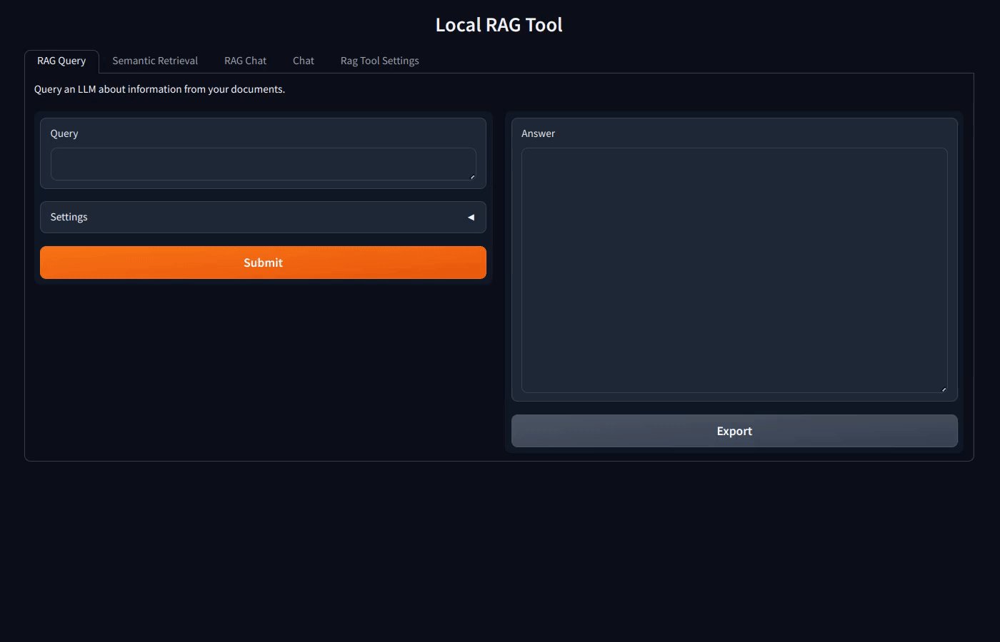

<table width="100%">
  <tr>
    <td align="left" valign="top">
      
    </td>
    <td align="right" valign="top">
      
    </td>
  </tr>
</table>

#

# Ask your documents!

## Retrieval Augmented Generation and Semantic-Search Tool (RAGSST)

A quick start, locally-run tool to test and use as basis for various document-related use cases:

- **Rag Query**: Prompt an LLM that uses relevant context to answer your queries.
- **Semantic Retrieval**: Retrieve relevant passages from documents, showing sources and relevance.
- **Rag Chat**: Interact with an LLM that utilizes document retrieval and chat history.
- **LLM Chat**: Chat and test a local LLM, without document context.
- **Multi Query RAG**: Generate multiple paraphrases of your query to improve retrieval coverage and find documents that might be missed by a single query formulation.
- **RAG Fusion**: Combine multiple query variations with weighted fusion scoring to rank and filter documents for more comprehensive results.
- **Decomposition RAG**: Break down complex queries into simpler subproblems, solve them sequentially or independently, then synthesize the final answer.
- **HyDE RAG**: Generate hypothetical documents that would answer your query, then use them for enhanced embedding-based retrieval.



The interface is divided into tabs for users to select and try the feature for the desired use case. The implementation is focused on simplicity, low-level components, and modularity, in order to depict the working principles and core elements, allowing developers and Python enthusiasts to modify and build upon.

Rag systems rely on sentence embeddings and vector databases. More information on embeddings can be found in our MOOC [Understanding Embeddings for Natural Language Processing](https://open.hpi.de/courses/embeddingsfornlp-kisz2023).


## Installation

### Windows Users: Install WSL2 First

If you are using Windows, you need to install the *Windows Subsystem for Linux* (*WSL*) before proceeding with the installation steps below. *WSL* allows you to run a Linux environment directly on Windows, which is required for running the installation scripts and *Ollama*. Note that for running *Ollama*, you need to install *WSL2*.

#### How to Install WSL

- Open PowerShell as Administrator (right-click the Start button and select "Windows PowerShell (Admin)").

- Run the following command:

   ```powershell
   wsl --install
   ```

   This will install *WSL2* (if your computer supports *WSL2*) and the default Ubuntu distribution. If prompted, restart your computer.

- After restart, open *Ubuntu* from the Start menu and follow the prompts to set up your Linux username and password.

- Update your Linux packages:

   ```sh
   sudo apt update && sudo apt upgrade
   ```

Once *WSL* is installed and set up, you can continue with the installation steps below from your *WSL* terminal.

---

1. Download or clone the repository.

2. Ensure that *uv* is installed.

For Linux/Windows:

```shell
$ pip install uv
```

For Mac:

```shell
$ brew install uv
```

### Option 1: Automatic Installation

3. In bash, run the following installation script:

```shell
$ bin/install.sh
```

The script might not work for MacOS, please follow the manual installation instructions.

### Option 2: Manual Installation

3. Create and activate a virtual environment (optional).

```shell
$ uv venv .myvenv
$ source .myvenv/bin/activate
```

4. Install dependencies.

```shell
(.myvenv)$ uv sync --active
```

5. Install **Ollama** to run Large Language Models (LLMs) locally. (Or follow the installation instructions for your operating system: [Install Ollama](https://ollama.com/download)).

```shell
(.myvenv)$ curl -fsSL https://ollama.ai/install.sh | sh
```

6. Choose and download an LLM [model](https://ollama.com/library) [\*]. For example:

```shell
(.myvenv)$ ollama pull llama3.2
```

## Alternative usage option: Docker Compose

3. Ensure you have Docker and Docker Compose installed.

4. Install the [latest NVIDIA drivers](https://www.nvidia.com/en-us/drivers/) for your GPU on your host system. Install the [NVIDIA Container Toolkit](https://docs.nvidia.com/datacenter/cloud-native/container-toolkit/latest/install-guide.html). (Only necessary for utilising a GPU.)


5. Build and start the app and Ollama

```sh
./run.sh
```

6. Wait for both services to start, which will take several minutes on the first run.

7. Open [http://localhost:7860](http://localhost:7860) or [http://127.0.0.1:7860](http://127.0.0.1:7860) in your browser.


## Usage

1. Place your documents in the intended data folder (default: `data/`).

2. Activate your virtual environment.

```shell
$ source .myvenv/bin/activate
```

3. Start the tool. [†]

```shell
(.myvenv)$ python3 app.py
```

or if you installed via Docker
la
```shell
$ ./run.sh
```

4. Open [http://localhost:7860](http://localhost:7860) in your web browser.

## Key Settings

### Retrieval Parameters

- **Relevance threshold**: Sets the minimum similarity threshold for retrieved passages. Lower values result in more selective retrieval.

- **Top n results**: Specifies the maximum number of relevant passages to retrieve.

### Additional Input parameters for the LLMs

- **Top k**: Ranks the output tokens in descending order of probability, selects the first *k* tokens to create a new distribution, and it samples the output from it. Higher values result in more diverse answers, and lower values will produce more conservative answers.

- **Temperature (Temp)**: This affects the 'randomness' of the answers  by scaling the probability distribution of the output elements. Increasing the temperature will make the model answer more creatively.

- **Top p**: Works together with *Top k*, but instead of selecting a fixed number of tokens, it selects enough tokens to cover the given cumulative probability. A higher value will produce more varied text, and a lower value will lead to more focused and conservative answers.

## FAQ

Check out the [Frequently Asked Questions (FAQ)](./FAQ.md) and please let us know if you encounter any problems.

---

[\*] Performance consideration: On notebooks/PCs with dedicated GPUs, models such as llama3.1, mistral or gemma2 should be able to run smoothly and rapidly. On a standard notebook, or if you encounter any memory of performance issues, prioritize smaller models such as llama3.2 or qwen2.5:3b.

## Development

Before committing, format the code using Black:

```shell
$ black -t py311 -S -l 99 .
```

Linters:

- Pylance
- flake8 (args: --max-line-length=100 --extend-ignore=E401,E501,E741)


For more detailed logging, set the `LOG_LEVEL` environment variable:

```shell
$ export LOG_LEVEL='DEBUG'
```

## Author
- [Joaquin Gomez Prats](https://github.com/slovanos)
- [Hanno Müller](https://github.com/hanno-mueller-HPI)


## License

[GPLv3](./LICENSE)
